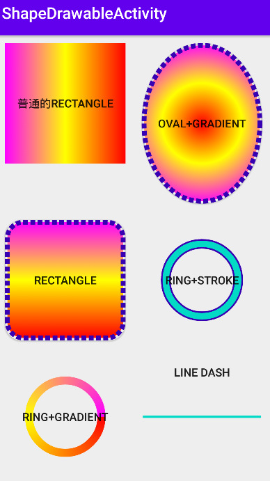
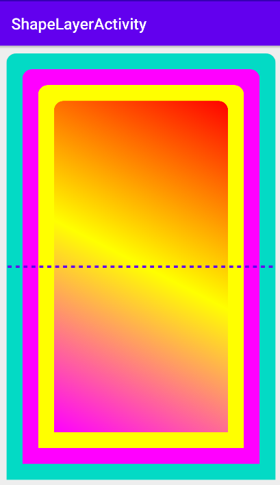
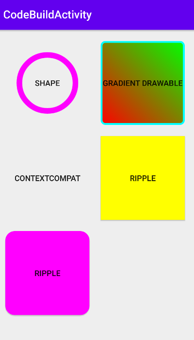
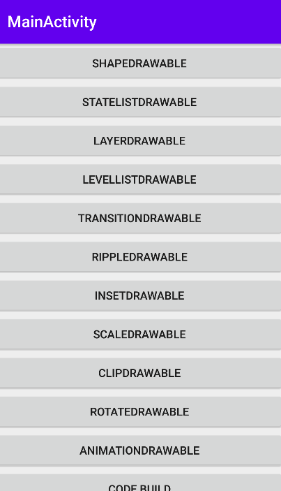

# DrawableDemo
## 查看源码可得知xml中与类的对应关系如下:
```java
private Drawable inflateFromTag(@NonNull String name) {
    switch (name) {
        case "selector":
        return new StateListDrawable();
        case "animated-selector":
        return new AnimatedStateListDrawable();
        case "level-list":
        return new LevelListDrawable();
        case "layer-list":
        return new LayerDrawable();
        case "transition":
        return new TransitionDrawable();
        case "ripple":
        return new RippleDrawable();
        case "adaptive-icon":
        return new AdaptiveIconDrawable();
        case "color":
        return new ColorDrawable();
        case "shape":
        return new GradientDrawable();
        case "vector":
        return new VectorDrawable();
        case "animated-vector":
        return new AnimatedVectorDrawable();
        case "scale":
        return new ScaleDrawable();
        case "clip":
        return new ClipDrawable();
        case "rotate":
        return new RotateDrawable();
        case "animated-rotate":
        return new AnimatedRotateDrawable();
        case "animation-list":
        return new AnimationDrawable();
        case "inset":
        return new InsetDrawable();
        case "bitmap":
        return new BitmapDrawable();
        case "nine-patch":
        return new NinePatchDrawable();
        case "animated-image":
        return new AnimatedImageDrawable();
        default:
        return null;
    }
}
```
## 1.shape使用示例


```xml
<?xml version="1.0" encoding="utf-8"?>
<shape xmlns:android="http://schemas.android.com/apk/res/android"
    android:shape="rectangle">

    <solid android:color="@color/colorAccent" />
    <corners android:radius="20dp" />
    <stroke
        android:width="6dp"
        android:color="@color/colorPrimaryDark"
        android:dashGap="3dp"
        android:dashWidth="6dp" />
    <gradient
        android:centerColor="@color/colorYellow"
        android:endColor="@color/colorPin"
        android:startColor="@color/colorRed"
        android:angle="90"
        android:type="linear" />
</shape>
```


## 2.layer-list使用示例

```xml
<?xml version="1.0" encoding="utf-8"?>
<layer-list xmlns:android="http://schemas.android.com/apk/res/android">
    <!-- 最底层 -->
    <item>
        <shape android:shape="rectangle">
            <solid android:color="@color/colorAccent" />

            <corners
                android:bottomLeftRadius="0dp"
                android:bottomRightRadius="0dp"
                android:topLeftRadius="12dp"
                android:topRightRadius="12dp" />
        </shape>
    </item>

    <!-- 第二层 -->
    <item
        android:bottom="20dp"
        android:left="20dp"
        android:right="20dp"
        android:top="20dp">
        <shape android:shape="rectangle">
            <solid android:color="@color/colorPin" />

            <corners
                android:bottomLeftRadius="0dp"
                android:bottomRightRadius="0dp"
                android:topLeftRadius="12dp"
                android:topRightRadius="12dp" />
        </shape>
    </item>

    <!-- 第三层：上左右距外围6dp，内部是渐变色3、右上带弧度的矩形 -->
    <item
        android:bottom="40dp"
        android:left="40dp"
        android:right="40dp"
        android:top="40dp">
        <shape android:shape="rectangle">
            <solid android:color="@color/colorYellow" />

            <corners
                android:bottomLeftRadius="0dp"
                android:bottomRightRadius="0dp"
                android:topLeftRadius="12dp"
                android:topRightRadius="12dp" />
        </shape>
    </item>


    <!-- 最上层 -->
    <item
        android:bottom="60dp"
        android:left="60dp"
        android:right="60dp"
        android:top="60dp">
        <shape android:shape="rectangle">

            <gradient
                android:angle="45"
                android:centerColor="@color/colorYellow"
                android:endColor="@color/colorRed"
                android:startColor="@color/colorPin"
                android:type="linear" />

            <corners
                android:bottomLeftRadius="0dp"
                android:bottomRightRadius="0dp"
                android:topLeftRadius="12dp"
                android:topRightRadius="12dp" />

        </shape>
    </item>
    <item>
        <shape
            android:shape="line">
            <stroke
                android:width="3dp"
                android:color="@color/colorPrimary"
                android:dashWidth="5dp"
                android:dashGap="5dp" />
        </shape>
    </item>
</layer-list>
```

## 3.代码方式使用示例


```kotlin
        //ShapeDrawable
        val mPath = Path()
        mPath.addCircle(150F,150F,100F,Path.Direction.CCW)
        val shapeDrawable = ShapeDrawable()
        //path stdWidth stdHeight会根据view实际大小进行等比缩放
        val pathShape = PathShape(mPath, 300F, 300F)
        shapeDrawable.shape = pathShape
        val paint = shapeDrawable.paint
        paint.style = Paint.Style.STROKE
        paint.strokeWidth = 20F
        shapeDrawable.setTint(Color.MAGENTA)
        shapeBt.background = shapeDrawable


        val drawable = ContextCompat.getDrawable(this, R.drawable.ripple_draw_01)
        rippleBt.background = drawable

        // rippleDrawable mask 颜色无效
        val rippleDrawable = RippleDrawable(
            ColorStateList.valueOf(Color.RED),
            ColorDrawable(Color.YELLOW), null
        )
        rippleBt1.background = rippleDrawable

        // rippleDrawable mask 颜色无效

        val shape = ShapeDrawable()
        val roundedCorners = floatArrayOf(50f, 50f, 50f, 50f, 50f, 50f, 50f, 50f)
        shape.shape = RoundRectShape(roundedCorners, null, roundedCorners)
        shape.setTint(Color.MAGENTA)

        val rippleDrawable2 = RippleDrawable(
            ColorStateList.valueOf(Color.BLUE),
            shape, null
        )
        rippleBt2.background = rippleDrawable2


        val gradientDrawable = GradientDrawable()
        gradientDrawable.shape = GradientDrawable.RECTANGLE
        gradientDrawable.setStroke(10,Color.CYAN)
        gradientDrawable.cornerRadius = 20F
        gradientDrawable.colors= intArrayOf(Color.RED,Color.GREEN)
        gradientDrawable.gradientType = GradientDrawable.LINEAR_GRADIENT
        gradientDrawable.orientation = GradientDrawable.Orientation.BL_TR
        shapeBt2.background = gradientDrawable
```
## 其他类型drawable可查看相关源码


### 参考文章 https://www.cnblogs.com/Jeely/p/11045042.html